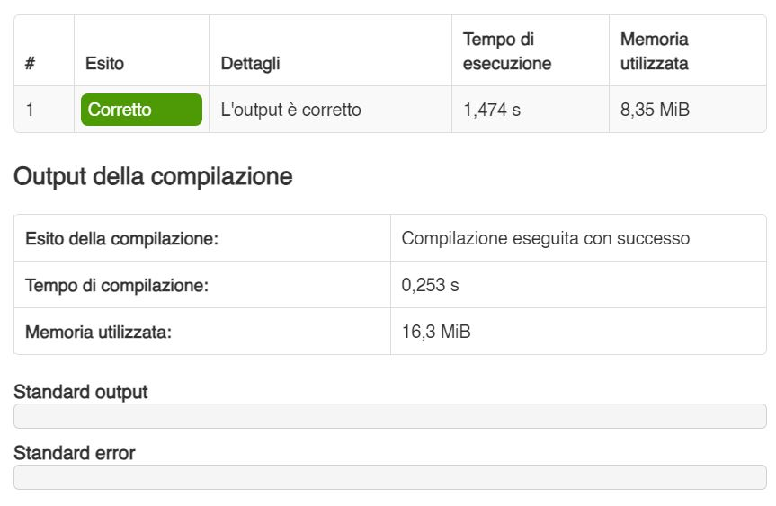

# PFAPI24_Marina_10797189 - Industrial Bakery Simulator

Discrete-time simulator of the inventory and order management of an industrial bakery, written in C
and optimized to run within strict time and memory limits.

- Course: Algoritmi e Strutture Dati (Algorithms and Data Structures)
- Academic year: 2023/2024
- Language: C
- Final grade: 30/30 cum laude

## Author

- Alessandro Marina (alessandro.marina@mail.polimi.it)

## Implementation status

Legend:

- 🟢: Implemented
- 🟡: Work in progress
- 🔴: Not implemented

Each row is a grade band of the official test suite, defined by a time limit and a memory limit. All
bands are passed, including the honours one.

| Time limit | Memory limit | Grade | Status |
|------------|--------------|-------|--------|
| 14.000 s   | 35.0 MiB     | 18    | 🟢     |
| 11.500 s   | 30.0 MiB     | 21    | 🟢     |
| 9.000 s    | 25.0 MiB     | 24    | 🟢     |
| 6.500 s    | 20.0 MiB     | 27    | 🟢     |
| 4.000 s    | 15.0 MiB     | 30    | 🟢     |
| 1.500 s    | 14.0 MiB     | 30L   | 🟢     |

## Overview

The program reads a stream of commands from standard input and advances a discrete time counter, one
step per command. It keeps track of the ingredients in stock with their expiry dates, of the recipes
of the bakery, and of the pending customer orders, and it writes the outcome of every command to
standard output.

The whole grade of the course depends on staying inside the limits of the table above, so the
implementation avoids dynamic overhead where possible and relies on data structures chosen for the
access patterns of the command stream rather than on generic containers.
